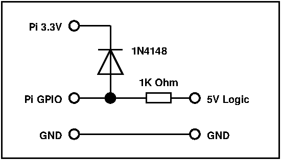

# ros2 rpi-ppm-input

This node reads a PPM signal from a Raspberry Pi GPIO pin using the RPi.GPIO library.
PPM signals are often output by RC type radio receivers. I have a Turnigy 9x radio with
a PCM to PPM converter and also a Radiolink R8FM. The R8FM makes a nice simple controller
for robots.

- PCM signals have a wire for each channel and encode the value as a pulse between 1000
  and 2000 microseconds. These mode of signaling is NOT supported by this node.
- PPM signals are similar to PCM, but the 8-12 channels are encoded on one wire where
  each channel is output serially one after the other with a missing pulse indicating
  the start/end of the channel grouping. This single-wire type of RC signaling is what
  this node reads.


# Raw PPM mode

By default this node will publish Int16MultiArray messages (array of 16bit ints) to the
/input/ppm topic. Each frame of PPM data will publish a new message and the size of the
message int array will match the number of channels read in the last PPM frame. This means
the number of elements in the array may change.

# Joystick mode

If 'mode' parameter is set to 'joy' then this node will publish as sensor_msgs/Joy. This
requires PPM channels are mapped to axes and buttons.

### Axes
The axis will be map PPM values of 1000 to 2000 to float ranges -1.0 to +1.0 but how these
are mapped exactly depends on the axis type. You can specify per-axis parameters using the
parameter namespace axis-# with sub-parameters of type, deadband, center, zero_point and
min_throttle. All axis numeric parameters are in PPM raw units (i.e. between 1000-2000)

#### type=midstick
This is your typical axis that snaps to center and will map to -1.0 to 1.0. You can optionally
provide a deadband (in PPM int counts, such as 30)

#### type=throttle
This mode acts like a throttle where full down is 0.0, there is some safety margin (zero_point=1200)
before throttle is activated (outputs non-zero) and the first throttle value starts at a
minimum amount of power (min_throttle=0).

#### type=trim
This axis assumes a trim pot and has a linear output of 0.0 to 1.0.


### Buttons

Buttons are channels mapped to simple integer switch positions 0, 1, 2, ... N where N is the
number of poles. Most switches are either 2 or 3 poles (2 or 3 way). By default switches are
2-way but you can easily specify which buttons are 3-way by listing them in an array '3-way'.

# Sample Params File
This example params.yml is for the R8FM tramsmitter.
```yaml
# Default channel settings for R8FM
# 0 - Roll (right)
# 1 - Pitch (right)
# 2 - Throttle (left)
# 3 - Yaw (left)
# 4 - Right 3-way
# 5 - Right button
# 6 - Left 3-way
# 7 - Left trim POT

ppm_input:
    ros__parameters:
        mode: joy
        # frame_id: preview
        # pin: <rpi gpio pin number, defaults to 7>
        joystick:
            # indexes channel IDs in the received PPM frame
            axis: [0,1,2,3,7]
            buttons: [4,5,6]
            # indicate some buttons are 3-way (have 3 poles)
            3-way: [4,6]
        # per-axis configuration
        axis-0:
            type: midstick
            deadband: 30
        axis-1:
            type: midstick
            deadband: 30
        axis-2:
            type: throttle
        axis-3:
            type: midstick
            deadband: 30
        axis-4:
            type: trim
```      

# Raspberry PI 3.3v GPIO
*The RPi pins are NOT 5v tolerant!* Most RC transmitters will output 5v TTL level. So be
sure to protect your RPi inputs with a 5v to 3.3v level converter. There are many options
available. 

I used this simple resistor and diode circuit to protect my RPi and it is working but I
make no warranties about it. I got this advice from [tansi.org](https://www.tansi.org/rp/interfacing5v.html)
who got it off the from someone on the RPi community. This circuit reduces the 4v down
to 4.2 volt which is apparently within the RPi pin input limits.




